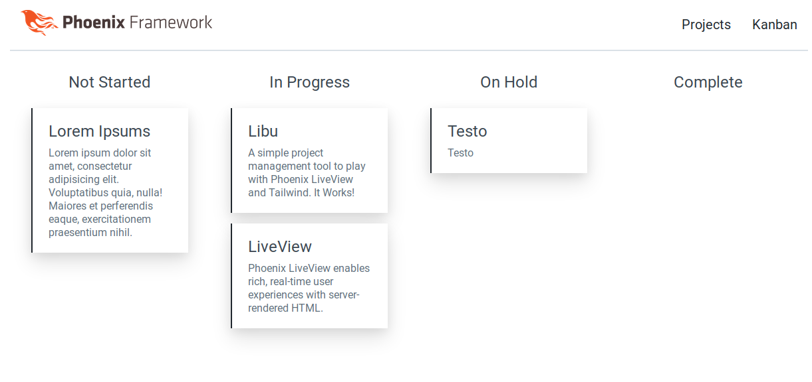

# Libu

A series of experimental features built around [Phoenix LiveView](https://github.com/phoenixframework/phoenix_live_view) capabilities.

Styled with [Tailwind CSS](https://github.com/tailwindcss/tailwindcss).

TODO:

## Overall:
- [x] Liveview "sanity check" clock
- [x] Styling

## Text Analysis
- [ ] Text Analysis Job processing
- [ ] Live Text Analysis Sessions
- [ ] Toggled Analyzer Strategies

## Projects
- [x] Live CRUD with FSM Changeset validation
- [x] KanBan LiveView of FSM
- [ ] Pagination, Sorting & Filters
- [ ] Search
- [ ] Voting
- [ ] Github Repo Integration

## Chat
- [ ] Live Chat
- [ ] Event Sourced Persistence
- [ ] Identity Integration
- [ ] Project Chats

## Identity
- [ ] Github OAuth Identity
- [ ] Auth required routes
- [ ] Avatar stuff

Take it for a spin:

  * Clone the repo: `git clone https://github.com/zblanco/libu.git`
  * Install dependencies with `mix deps.get`
  * Create and migrate your database with `mix ecto.setup`
  * Install Node.js dependencies with `cd assets && npm install`
  * Switch back to the project directory `cd ../`
  * Start Phoenix endpoint with `mix phx.server` or `iex -S mix phx.server`

Now you can visit [`localhost:4000`](http://localhost:4000) from your browser.

## Feature Notes

### Projects

To start I wanted to get a feel for how LiveView works with the typical CRUD app. Turns out it works really well and a weekend in I had full CRUD actions on a Project model. Implementing a Kanban view was easy with our friend `Enum.group_by`. 

The plan is to use this to try out pagination, search, list-views, and other basic admin interface capabilities. I'm considering changing this Project Management context into more of a Liveview Project Sharing featureset with voting, view counting, commenting, and Github integrations. The Kanban features can be pulled out into a Dashboarding library instead.

### Analysis

The goal was to render a live analysis of the text you type. I initially just used stateless functions for basic Sentiment analysis and word counting as a proof of concept. Stateless functions like this allow us to just call in from the LiveView which is about as easy as it gets. However the interesting features emerge when we enable stateful capabilities and start chaining text analysis strategies together.

The plan to tackle these stateful features is to start a 1:1 Analysis Session process upon the LiveView mount (`DynamicSupervisor` FTW). Next we need the LiveView state to be sent to this Session state where it can notify and enqueue Text Analysis jobs. Some of these Analyzers might be long-running or expensive, so we want each Analyzer strategy to have control over work it does. Once an Analysis job is completed we can persist the results to ETS and notify over pub sub where our LiveView can fetch the latest results from ETS via the Session Id. 

Maintaining a 1:1 session with a given LiveView allows us to decouple the LiveView process of concerns that should be owned by our `Analysis` context. This session is implemented via a GenServer spawned under a DynamicSupervisor, then killed upon notification of the sister LiveView termination. There is sufficient complexity in managing the ETS tables, enqueueing analysis jobs, and holding analyzer configuration to warrant hiding this from our LiveView state. All our LiveView knows is that it can send text over with a Session key and it will be notified when to fetch new results.

*A further optimization is to only send Operational Transform events to our Analyis Session to minimize copying the whole contents each edit. Pushing around OT messages like this is also a good way to lead into collaborative features. We can do OT from the LiveView -> Session, but we'd rather do that from the Client -> LiveView && Session to really minimizing payload sizes. I'm waiting until the Liveview project has a better story for Javascript interop before doing these OT related features*

### Chat

Chat is a more classic feature for Elixir/Phoenix applications. I wanted to deviate from the typical implementation using Ecto and Postgres in a classic "append message to chat room" and implement the features in-memory with OTP and ETS. The plan was to layer on the Text Analysis features to provide live insight to the aggregate metrics of a conversation. The naive implementation was to run a GenServer for each Conversation (i.e. Chat Room) thus serializing the messages, but didn't want a GenServer bottle-necking a very active Conversation.

Instead I'm working on a more event-sourced solution with a similar Session Process approach as `Text Analysis` but with a per-user Session that knows where the User is in the Conversation so we can stream down only the visible messages of the Conversation. The plan is to use ETS as a dynamic projection to recently queried messages from our Sessions. We can still use a GenServer as an Aggregate for each conversation, but we'll have more control over the Command side to rate-limit or slow-down as necessary.

*Once the Liveview project has some more established patterns for getting and maintaining the View/Scroll position/state of the client, these Live Chat type features should be straight-forward.*

### Identity

We just want a minimal user model for persistence and deferred authentication via OAuth2 with Github. Some other contexts like Chat will require a `:current_user` to publish messages.